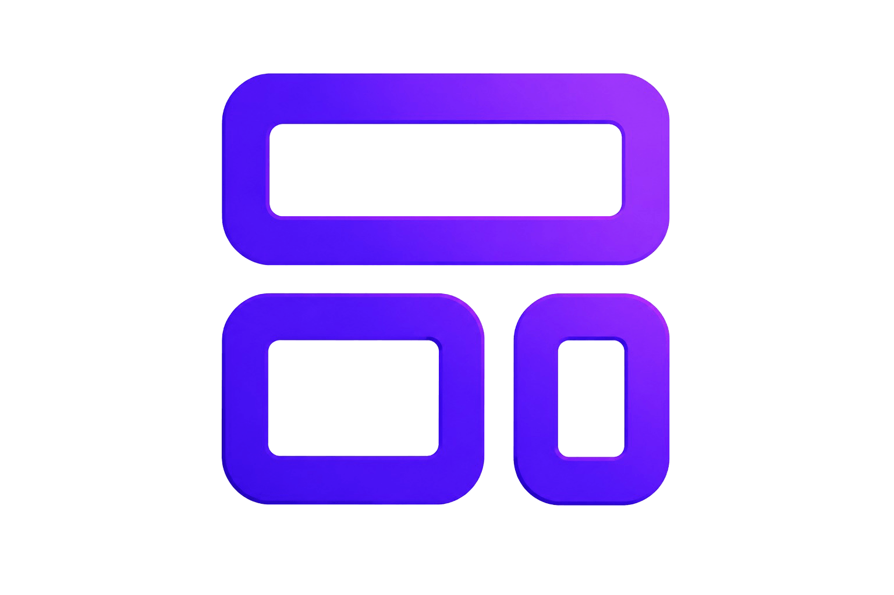

# 🚀 UpSite

<div align="center">
  
</div>

<br/>

Welcome to **UpSite**, a modern, blazing fast, and highly interactive Web Development & IT Agency landing page. Built to convert, designed to impress!

## ✨ Features

- ⚡️ **Blazing Fast**: Powered by Vite and React 18
- 🎨 **Modern Design**: Styled using the latest Tailwind CSS v4
- 🎞️ **Smooth Animations**: High-performance scroll animations using Framer Motion (LazyMotion optimized)
- 📱 **Fully Responsive**: Flawless experience across desktop, tablet, and mobile devices
- 🔍 **SEO Optimized**: Pre-configured `robots.txt`, dynamic language tags, and high Lighthouse scores
- ♿️ **Accessible**: Keyboard navigable and screen-reader friendly (Perfect 100 Accessibility Score)

## 🛠️ Tech Stack

- **Framework**: React 18 + Vite
- **Styling**: Tailwind CSS v4
- **Animations**: Framer Motion
- **Icons**: Lucide React
- **Deployment**: Vercel Ready

## 📦 Getting Started

### Prerequisites
Make sure you have Node.js installed (v18+ recommended).

### Installation
1. Clone the repository
   ```bash
   git clone https://github.com/FikihRizaldi/UpSite.git
   cd UpSite
   ```
2. Install dependencies
   ```bash
   npm install
   ```
3. Run the development server
   ```bash
   npm run dev
   ```
4. Open your browser and visit `http://localhost:5173`

## 🚀 Building for Production

To create an optimized production build:
```bash
npm run build
npm run preview
```

## 👨‍💻 Contributors

This project was built collaboratively by an amazing team:
- **[FikihRizaldi](https://github.com/FikihRizaldi)**
- **DaffaPmgks**
- **regianamikom**
- **Redomas Baegy Hardianathan**

---
<div align="center">
Built with ❤️ for a better digital future.
</div>
